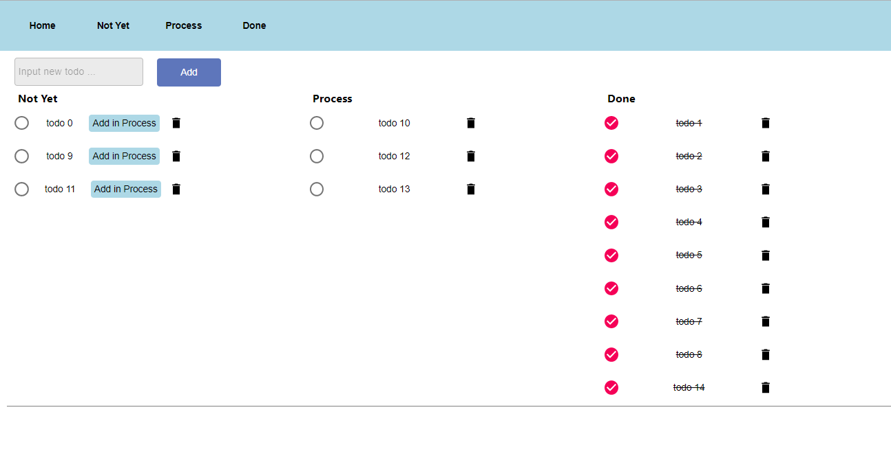
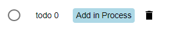
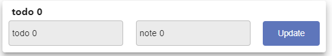

# Todo List App - TypeScript

Pham Thi Thuy ( D1.Intern-ReactNative )
@vercel: https://ts-todo-list.vercel.app/

## Pages

* Home: 

    ** Add new todo list
        
        - Input fields to insert new todo item
        - Deadline fields
        - Button to submit

    ** List all todo item include: 

        - Not yet 
        - Processing 
        - Done

* Not Yet:
    ** List item not yet

* Process:
    ** List item in processing

* Done:
    ** List item has done

## Item

Include: 
    * Checkbox: true = done | false = [not yet, process]
    * title
    * Add in Process Button: move to process list
    * Delete
    * Click to title to update item

